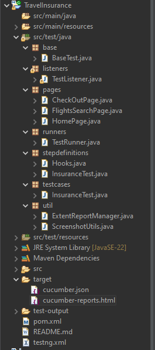
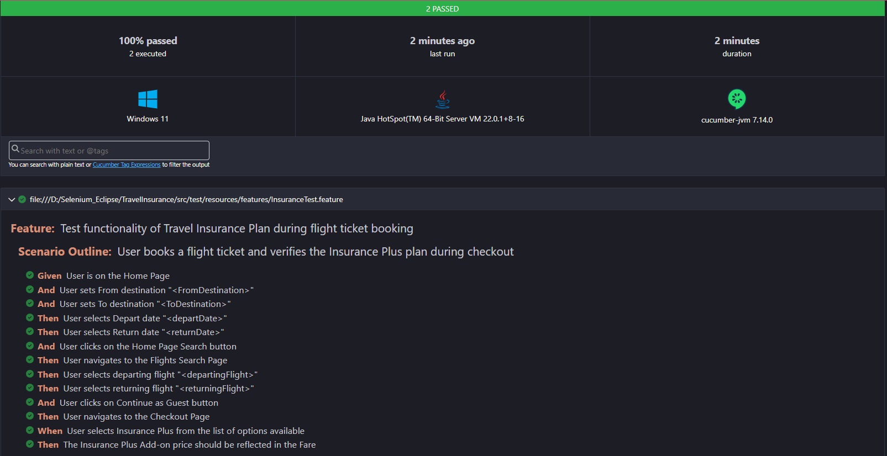

# Allianz Malaysia Assesment

The project includes a pom.xml file (suggesting Maven for dependency management), a testng.xml for configuring TestNG test execution, and some source code in the src/test directory.

- **src/main/java:** Typically for the application code (not visible here but often present in some projects).

- **src/test/java:** Contains test scripts and step definitions.

- **src/test/resources/features:** Contains feature files written in Gherkin syntax. These files define test scenarios in a human-readable format, outlining the behavior of the application under test

- **testng.xml:** Configuration file for TestNG test execution.

- **pom.xml:** Maven configuration for managing dependencies.

## Test Results

Click [Here](./cucumber-reports.html) to view complete test report

